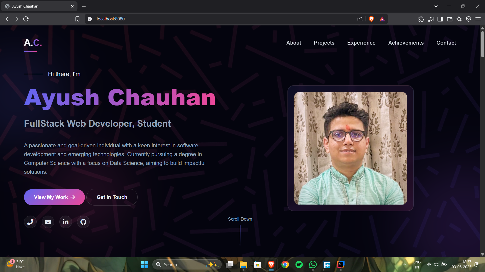

# 🌐 Personal Portfolio Website – Java Spring Boot | Thymeleaf | Bootstrap 5

Welcome to my **fully responsive and dynamic personal portfolio website** built using **Java Spring Boot**, **Thymeleaf**, and **Bootstrap 5**. This project serves as both a learning milestone and a professional showcase of my skills as a full-stack Java developer.

---

## 🚀 Features

* ✅ **Spring Boot** backend for clean, scalable architecture
* ✅ **Thymeleaf** integration for dynamic HTML templating
* ✅ **Responsive UI** built with **Bootstrap 5**
* ✅ Organized project structure with reusable components
* ✅ Ready for deployment and open to further enhancements

---

## 📂 Project Structure

```
📁 src
 ┣ 📂 main
 ┃ ┣ 📂 java
 ┃ ┃ ┗ 📂 com.yourname.portfolio
 ┃ ┃   ┗ 📄 PortfolioController.java
 ┃ ┣ 📂 resources
 ┃ ┃ ┣ 📂 templates
 ┃ ┃ ┃ ┗ 📄 index.html
 ┃ ┃ ┣ 📂 static
 ┃ ┃ ┃ ┣ 📄 styles.css
 ┃ ┃ ┃ ┗ 📄 script.js
 ┃ ┃ ┗ 📄 application.properties
```

---

## 💡 Tech Stack

* **Java 17+**
* **Spring Boot**
* **Thymeleaf**
* **Bootstrap 5**
* **HTML5 & CSS3**
* **Maven**

---

## 🌟 Why I Built This

I created this portfolio to:

* Present my projects and skills in a clean, professional format
* Gain hands-on experience with Spring Boot and Thymeleaf
* Apply front-end and back-end integration in a real-world scenario
* Build a solid foundation for future full-stack development projects

---

## 📷 Preview


*A modern, responsive design tailored to highlight projects, skills, and contact information.*

---

## 🔗 Useful Resources

* [Spring Boot Documentation](https://spring.io/projects/spring-boot)
* [Thymeleaf Documentation](https://www.thymeleaf.org/documentation.html)
* [Bootstrap 5 Documentation](https://getbootstrap.com/docs/5.0/getting-started/introduction/)

---

## 📌 Keywords

`Java Portfolio` `Spring Boot Website` `Thymeleaf Template` `Responsive Portfolio`
`Java Web Application` `Bootstrap UI` `Full Stack Development` `Java Developer Portfolio`

---

## 📬 Contact

Want to collaborate or know more about the project?
📧 Email: \[[chauhan0007ayush@gmail.com](mailto:chauhan0007ayush@gmail.com)]
🔗 LinkedIn: \[https://www.linkedin.com/in/ayushchauhan7/]
🌐 Portfolio: https://portfolio-production-f800.up.railway.app/

---

> If you found this project helpful or interesting, feel free to ⭐ the repo or fork it for your own use!

---

